# Home Server & Smart Home: A Laptop and a Raspberry Pi Running My Whole Room

A retired Acer gaming laptop and a Raspberry Pi 4, running a fully local, subscription-free smart home: Home Assistant controlling RF, IR, and Bluetooth devices, a voice assistant on a rooted Echo Dot, a local LLM on the laptop's GPU, network storage, and a custom-built ESP32 music control panel.

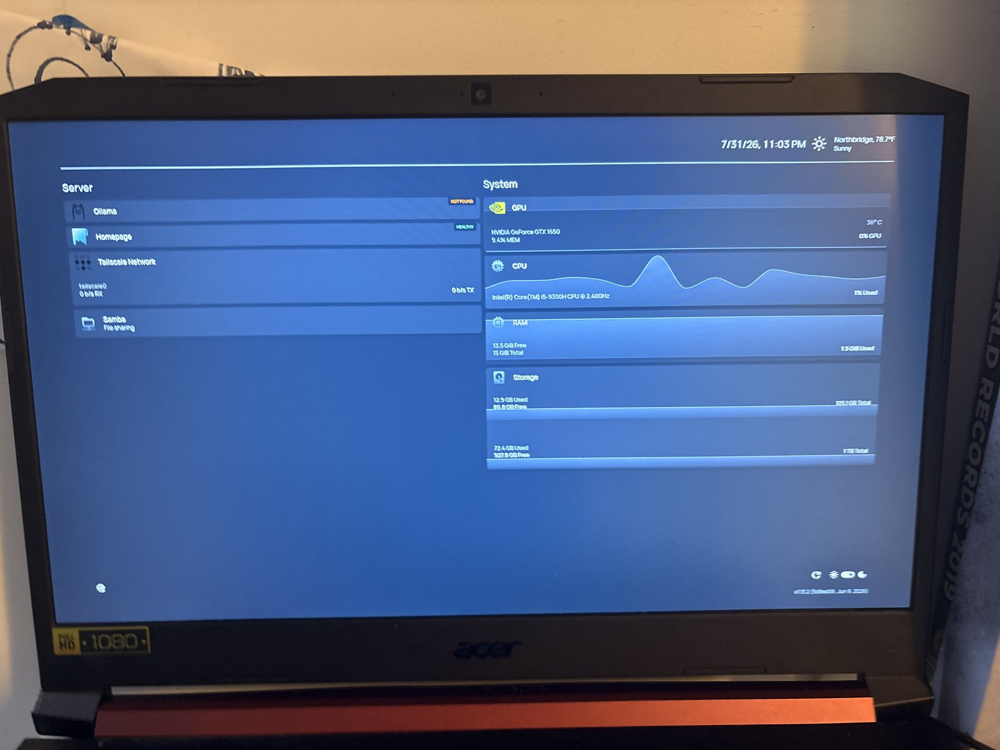

## Highlights

- **Home Assistant** ties together RF, IR, Bluetooth, MIDI, voice, and custom hardware
- **Local voice assistant** ("Bishop"): Whisper, a local LLM on a GTX 1650, and Piper, with a rooted Echo Dot as the mic and speaker
- **Custom hardware:** Arduino RF bridge, IR transmitter, and an ESP32 music panel I designed, wired, and 3D-printed a case for
- **Plays chords to control the house:** a MIDI keyboard plugged into the laptop triggers Home Assistant actions
- **No cloud, no subscriptions:** everything is open source and runs at home, reachable remotely over Tailscale

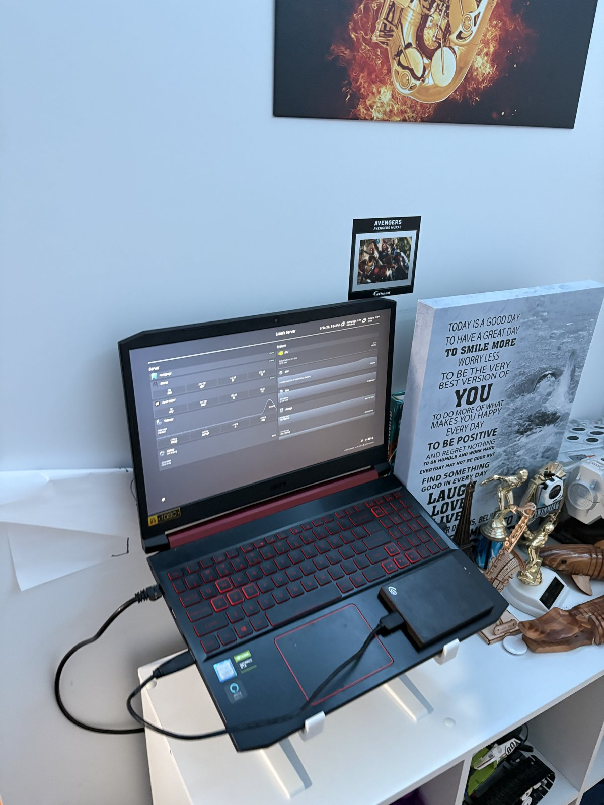

## Smart home integrations

| Integration | How it works |
|---|---|
| **Ceiling fan and light (RF, 315 MHz)** | Arduino Uno + CC1101 transceiver on the Pi replays the fan remote's RF protocol. A small Flask API bridges it to Home Assistant as `fan` and `light` entities. |
| **Ceiling and desk LED strips (IR)** | IR transmitter on the Pi fires captured remote codes through a Flask API, with per-strip repeat counts so each strip reliably registers the command. Exposed to Home Assistant as lights. |
| **Display LED strip (Bluetooth LE)** | ELK-BLEDOM strip controlled directly from the server through Home Assistant's `elkbledom` integration, with a keepalive automation to hold the connection. Its color follows the album art of whatever is playing. |
| **MIDI keyboard chords** | A MIDI keyboard plugged into the laptop plays through FluidSynth and is watched by a pattern-matching service. Specific chords and melodies trigger Home Assistant actions. |
| **ESP32 music control panel** | A from-scratch hardware controller: LCD, rotary knob, and buttons in a 3D-printed enclosure that controls music playback. |
| **Music** | Music Assistant streams through Snapcast to a Bluetooth speaker on the Pi. |
| **Voice ("Bishop")** | Echo Dot (rooted, running EchoMuse) sends speech to Whisper, a local Ollama model acts as the Home Assistant conversation agent, and Piper speaks the reply. Common commands (like fan speed) use sentence triggers that skip the LLM for speed. |
| **Server controls** | Screen on/off and a camera stream, both controllable from Home Assistant. |

### Arduino Uno + RF transmitter (fan and light)

The ceiling fan's remote is a 315 MHz RF device. An Arduino Uno with a CC1101 transceiver module, connected by USB to the Raspberry Pi, transmits the matching protocol. The Pi runs a small Flask API that sends commands to the Arduino over serial, and Home Assistant calls that API. A "cycle lights" script uses a timed loop with an adjustable duration.

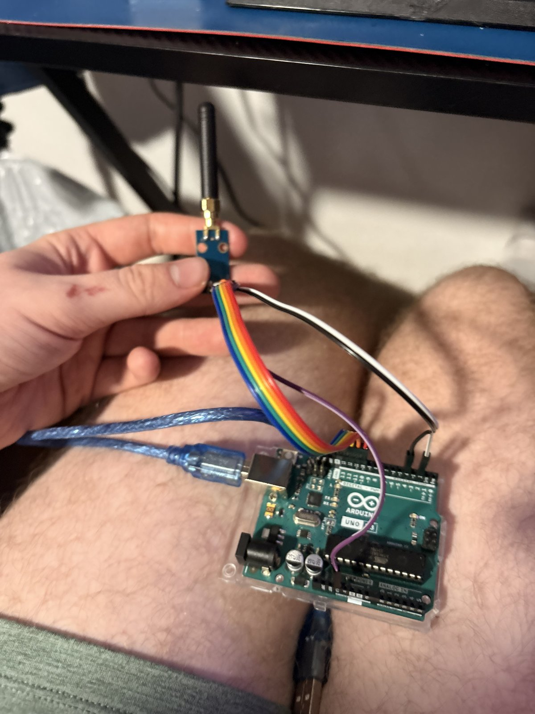
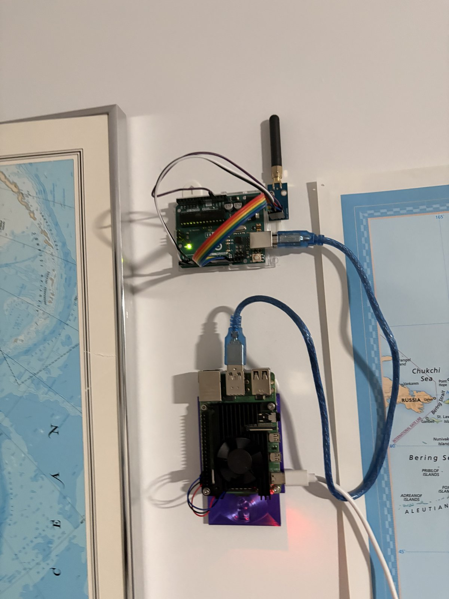

### IR transmitter (LED strips)

The Pi drives an IR LED from a GPIO pin to replay codes captured from the strips' remotes. The same pin is shared with an IR receiver module used for capturing codes, swapped by hand since both are never needed at once.

### Bluetooth display LEDs

<!-- CONFIRM: what "display LEDs" are physically (behind the monitor?) -->
The display LED strip connects over Bluetooth LE directly from the server. Because BLE shares the laptop's internal radio, connections can drop occasionally; the planned fix is an ESPHome Bluetooth proxy on a spare ESP32.

### MIDI chords

<!-- CONFIRM: keyboard model and the actual chord-to-action mappings you want shown -->
A MIDI keyboard plugged into the laptop is both an instrument and a controller. One service renders notes through FluidSynth so you hear a piano, and another watches for chord and melody patterns with held-note tracking and per-pattern debounce, then calls Home Assistant to run the mapped action.

### ESP32 music control panel

<!-- CONFIRM: how it talks to Home Assistant (MQTT / ESPHome / REST), what each button and the knob does, firmware language -->
I built this controller from scratch: prototyped on a breadboard, designed the enclosure in CAD, 3D-printed it, and mounted it on the wall.

| Breadboard prototype | LCD test |
|---|---|
| 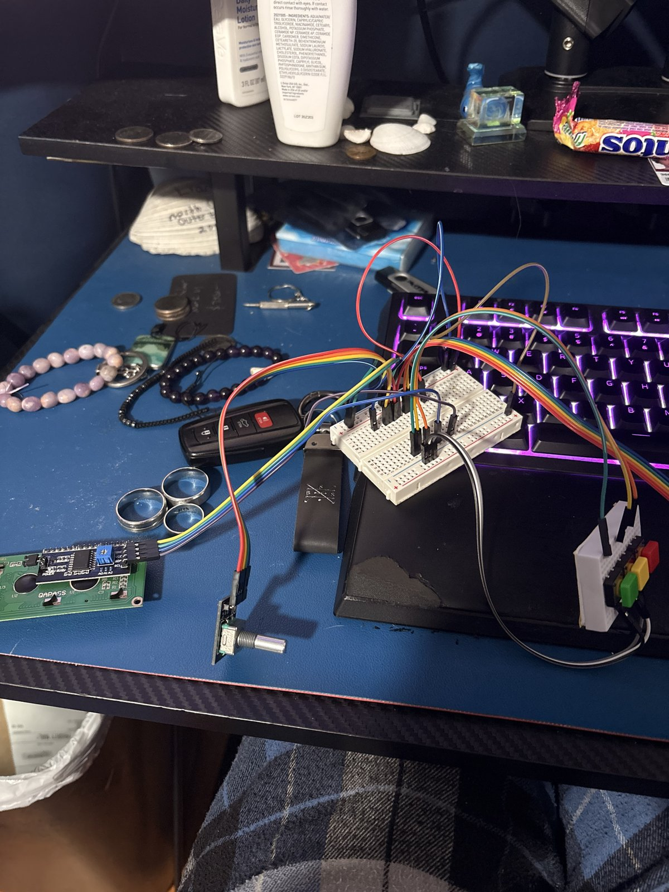 | 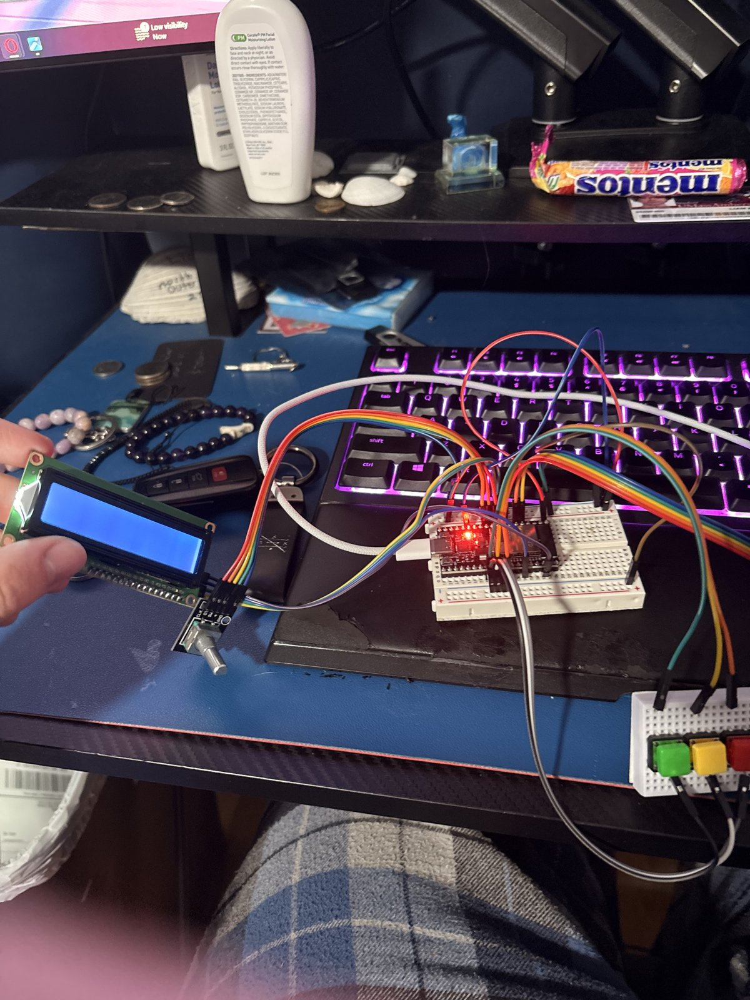 |

| Enclosure design (CAD) | Installed on the wall |
|---|---|
| 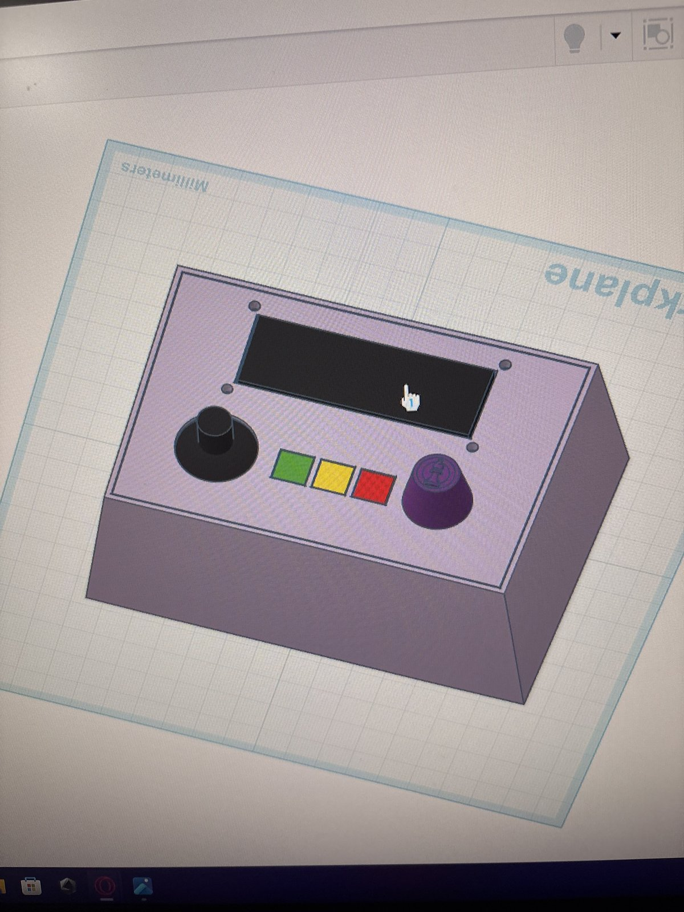 | 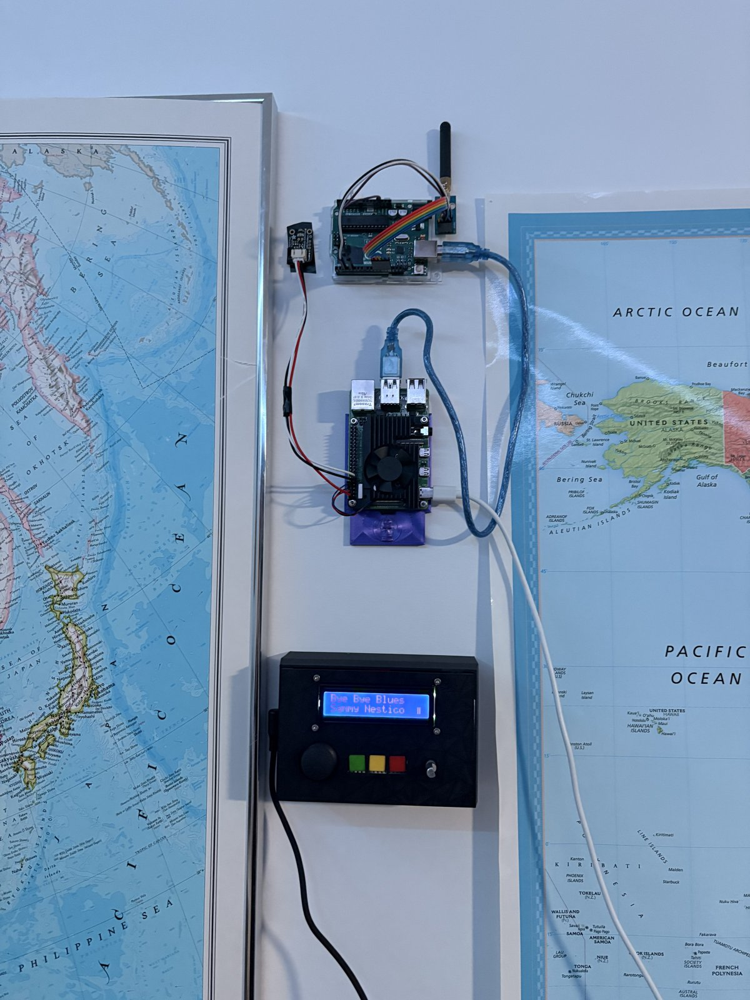 |

### Voice assistant

An Echo Dot 2nd gen, rooted and running EchoMuse, acts as a local microphone and speaker with no Amazon cloud involved. Speech goes to Wyoming Whisper, a local LLM (Ollama) acts as the Home Assistant conversation agent, and Wyoming Piper speaks the answer.

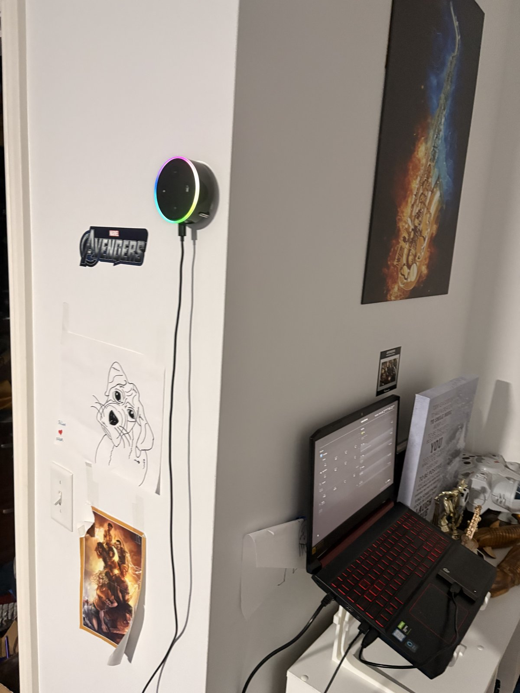

## The hardware

| Device | Role |
|---|---|
| Acer Nitro 5 (i5-9300H, GTX 1650 4 GB, 16 GB RAM) | Main server: Docker, Home Assistant, Ollama |
| Raspberry Pi 4 | Hardware bridge: RF, IR, Bluetooth audio |
| Arduino Uno + CC1101 | 315 MHz RF transmitter |
| ESP32 + LCD + rotary encoder + buttons | Custom music control panel |
| Echo Dot (2nd gen, rooted) | Voice interface |
| External Seagate drive (ext4) | Storage and backups |

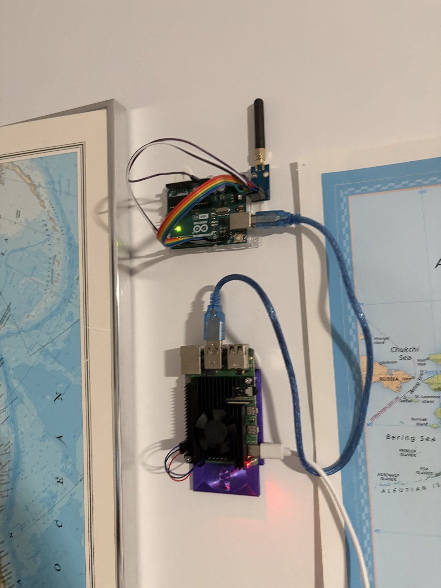
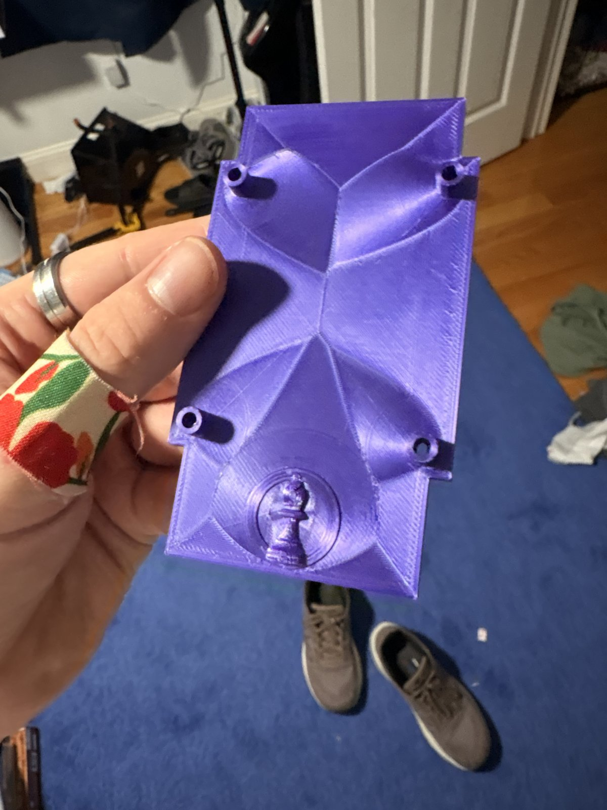

## Architecture

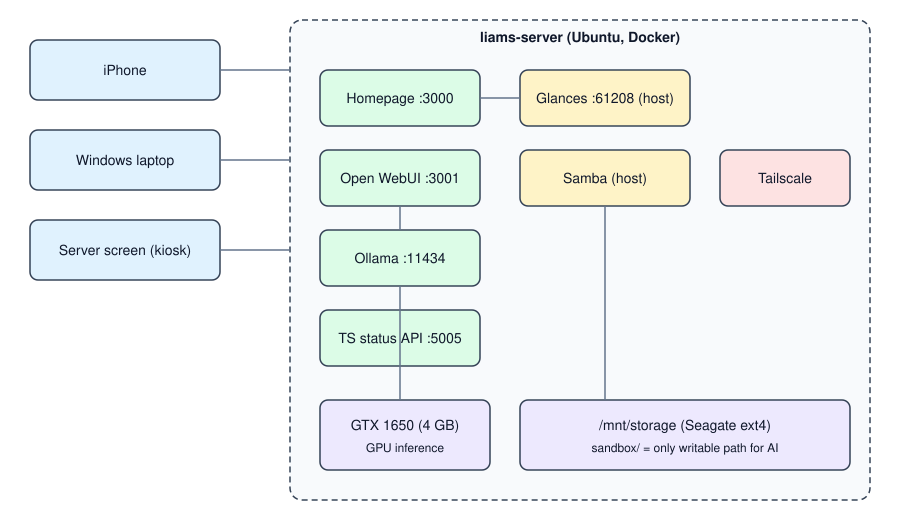

The pattern that ties it together: **each hardware capability is a small Flask HTTP API, and Home Assistant calls it with `rest_command`.** IR, RF, screen control, camera, and color extraction all follow it. Everything runs as a systemd service.

## Server stack

| Service | Runs as | Purpose |
|---|---|---|
| Home Assistant | Docker (host net) | Smart home hub, served over HTTPS with Tailscale Serve |
| Ollama | Docker | Local LLM (GPU) |
| Open WebUI | Docker | Chat UI with custom sandboxed file and image tools |
| Wyoming Whisper / Piper | Docker | Speech to text / text to speech |
| Music Assistant | Docker | Music library and Snapcast streaming |
| Homepage + Glances | Docker / host | Dashboard shown in kiosk mode on the laptop screen |
| Vaultwarden | Docker | Password manager, weekly automated backups |
| Samba, Tailscale | Host | File sharing and remote access |

## Design decisions

- **Samba and Tailscale run on the host, not in containers.** Both need direct access to the host network stack and filesystem.
- **AI tools are sandboxed.** The model can read the share but write only inside a `sandbox/` folder, with path-traversal protection. `docker.sock` is never mounted into an AI-accessible container, and SSH keys are excluded from read scopes.
- **Fully local.** Ollama is never exposed publicly; remote access is Tailscale only.
- **Simple over clever.** A plain IR toggle beats state-tracking logic; VT switching beats scripted close mechanisms.

## Write-ups

- [Home Assistant integrations in detail](docs/home-assistant.md)
- [Hardware and storage](docs/hardware.md): including the LVM fix that recovered 130 GB
- [Networking](docs/networking.md)
- [Kiosk display](docs/kiosk.md)
- [Local AI stack](docs/ai-setup.md)
- [Troubleshooting: the tool-calling bug hunt](docs/troubleshooting.md)

## Repo layout

```
docker/            compose files for each service
homeassistant/     config snippets, dashboard, automations
pi/                Flask bridge APIs and Arduino sketch
esp32-panel/       firmware and enclosure files for the music panel
openwebui-tools/   custom Python tools for Open WebUI
scripts/           helper scripts
docs/              detailed write-ups
images/            photos and diagrams
```

## Roadmap

- [ ] ESPHome Bluetooth proxy to stabilize the BLE LED strip
- [ ] Vision model (moondream) for image understanding
- [ ] Self-hosted calendar (CalDAV) integrated with Home Assistant
- [ ] Automated config backups

## Notes

IPs, hostnames, MAC addresses, and tokens are omitted or replaced with placeholders.
